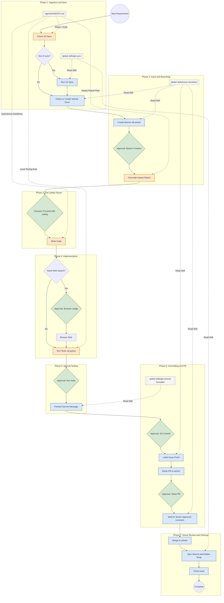

# End-to-End Requirement Execution Workflow

This document outlines the strict, phase-wise execution flow the AI agent follows when handling a new requirement, including all human approval gates and the configuration files that dictate the agent's behavior.

## Workflow Diagram

## Phase-by-Phase Breakdown

### Phase 1: Ingestion & Environment Sync
**Trigger:** You type a new feature requirement into the chat.
* 🧠 **File Activated:** `.agents/AGENTS.md` (Phase 1 Rule)
   * **Action**: Before reading your requirement fully, this rule forces a background check (`git fetch` / `git status`) to ensure local code isn't outdated.
* 🧠 **File Activated (If Stale):** `~/.gemini/config/skills/git-sync/SKILL.md`
   * **Action**: If out of sync, stop, inform you, and ask for **Explicit Approval** to run the Git Sync skill to pull the latest changes.

### Phase 2: Issue Creation & Branching
* 🧠 **File Activated:** `.agents/AGENTS.md` (Mandatory Branching Protocol)
   * **Action**: Forbids coding on the main branch and redirects to the Issue Workflow.
* 🧠 **File Activated:** `~/.gemini/config/skills/issue-resolution-workflow/SKILL.md`
   * **Action**: Check GitHub. If no issue exists, assist in creating one via the `gh` CLI.
   * **Action**: Branch off `ashish` using the format `ashish-issue-<number>-<description>`. 
   * 🛑 **APPROVAL GATE**: Explain terminal commands and ask for **Explicit Approval** to create and push the branch.

### Phase 3: The Safety Pause & Impact Report
* 🧠 **File Activated:** `.agents/AGENTS.md` (Pre-Execution Impact Report)
   * **Action**: A hard stop. No code can be written yet. 
   * **Action**: Generate a plain-English report outlining the Current Flow, New Flow, and Business Logic Impact.
   * 🛑 **APPROVAL GATE**: Hard-locked until you type your consent string in the chat panel. 

### Phase 4: Implementation (With Guardrails)
* 🧠 **File Activated:** `.agents/AGENTS.md` (Operational Guidelines & Browser Guardrail)
   * **Action**: Begin writing code. 
   * **Action**: The Browser Guardrail forces a pause for **Explicit Approval** if an external web search is needed. 
   * **Action**: Ensure the `expenses.db` schema is not modified. Iterate on the same branch based on local testing.

### Phase 5: Quality Assurance & Testing
* 🧠 **File Activated (Optional):** `.agents/skills/code-review/SKILL.md`
   * **Action**: If requested, check for SQLite SQL-injection, Streamlit caching issues, and PEP8 standards.
* 🧠 **File Activated:** `.agents/AGENTS.md` (Local Testing Phase Rule)
   * 🛑 **APPROVAL GATE**: State readiness to run tests and wait for **Explicit Approval**.
   * **Action**: Execute `uv run pytest tests/unit tests/integration`.

### Phase 6: Committing & PR
* 🧠 **File Activated:** `~/.gemini/config/skills/git-commit-formatter/SKILL.md`
   * **Action**: Generate a "Conventional Commit" message (e.g., `feat(auth): add login`).
* 🧠 **File Activated:** `.agents/AGENTS.md` (Git Commits Rule)
   * 🛑 **APPROVAL GATE**: Propose the commit message and wait for **Explicit Approval**.
* 🧠 **File Activated:** `~/.gemini/config/skills/issue-resolution-workflow/SKILL.md`
   * **Action**: Update the GitHub issue to have only the 'Fixed' label.
   * 🛑 **APPROVAL GATE**: Ask for permission to raise a Pull Request targeting the `ashish` branch.

### Phase 7: The Senior Review & Cleanup
* 🧠 **File Activated:** `~/.gemini/config/skills/issue-resolution-workflow/SKILL.md`
   * **Action**: Wait for the senior developer to comment "Approved" or "LGTM" on the GitHub PR.
   * **Action**: Merge it into `ashish`. Automatically delete the temporary feature branch.
* 🧠 **File Activated:** `~/.gemini/config/skills/git-sync/SKILL.md`
   * **Action**: Pull the freshly merged `ashish` branch down to the local machine.
   * **Action**: Close the GitHub issue with a "Resolved" comment.
